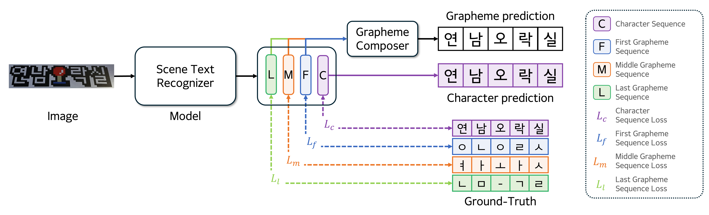

# GraphemeSTR_v1

### Architecture

### Framework
This project is based on ["PPOCR"](https://github.com/PaddlePaddle/PaddleOCR) Framework

### Environment setting
Refer to the basic framework(PPOCR)

### Management through Resource DB
This project manage deep learning resources as simple db
each type of resource has their db manager.
for example LabelsetDB provides some useful functions for labelsets like making new labelset from dataset.
WorkDB provides work relative functions like making trianing bash code

### Resources
datasets: dataset folder
labelsets: composition of datasets
models: model
works: model + labelset

### How to run (train, test)
1. prepare your datasets and put it in the folder "datasets"
2. make a new lableset by using LabetsetDB
3. make a new work including the model and the labelset you want to use by using WorkDB
4. create train or eval code through the WorkDB
5. excute the created bash code

